# 🍽️ Restaurant-PWA


---

## 📋 Descripción General

**Restaurant-PWA** es una Progressive Web App (PWA) diseñada para la gestión integral de restaurantes. El sistema centraliza todas las operaciones del negocio — desde la toma de pedidos hasta el cierre de caja — en una plataforma web instalable, funcional en dispositivos móviles y de escritorio.

El sistema opera en **dos modalidades de servicio**:

- **Autoservicio**: El cliente escanea un QR en su mesa, consulta el menú digital, arma su pedido desde su propio dispositivo y lo envía directamente a cocina. No requiere la intervención de un mesero.
- **Con Mesero**: El mesero gestiona las mesas asignadas, toma pedidos de forma manual desde su panel y los comunica a cocina en tiempo real. Soporta flujos completos de solicitud de cuenta, procesamiento de pago y liberación de mesa.

Ambas modalidades comparten el mismo backend, base de datos y canal de comunicación en tiempo real (WebSockets), garantizando consistencia operacional en toda la plataforma.

---

## ✨ Características Principales

- **Gestión de roles granular**: cinco roles de usuario con vistas, permisos y flujos de trabajo independientes (Cliente, Mesero, Cocina, Caja, Administrador).
- **Autenticación segura con JWT**: tokens firmados para proteger todos los endpoints de la API; middleware de verificación de rol por ruta.
- **Actualizaciones en tiempo real vía WebSockets**: el estado de los pedidos se propaga instantáneamente entre el cliente (tracker), el panel de cocina (KDS), el mesero y la caja — sin necesidad de refrescar la página.
- **Sistema KDS (Kitchen Display System)**: pantalla de cocina con temporizadores por pedido, control de estado y panel de inventario de bodega integrado.
- **Gestión de inventario y recetas**: control de stock de ingredientes, deducción automática al confirmar pedidos, alertas de bajo stock y registro de movimientos.
- **Caché con Redis**: sesiones de usuario y datos de configuración cacheados para reducir la carga sobre PostgreSQL.
- **Gestión de turnos y retiros de caja**: apertura/cierre de turno, retiros parciales, conciliación de caja con exportación a Excel.
- **Subida de imágenes para el menú**: soporte para almacenamiento local (`/uploads`) y Cloudinary como proveedor en la nube.
- **Instalable como PWA**: service worker, manifest y íconos configurados para instalación en dispositivos móviles y de escritorio.
- **Orquestación con Docker Compose**: levantamiento completo del entorno (frontend, backend, PostgreSQL, Redis) con un solo comando.

---

## 🛠️ Stack Tecnológico

| Capa | Tecnología | Versión | Propósito |
|---|---|---|---|
| **Frontend** | React | 19 | Librería principal de UI |
| **Frontend** | TypeScript | 5.9 | Tipado estático en cliente |
| **Frontend** | Vite | 7 | Bundler y servidor de desarrollo |
| **Frontend** | React Router DOM | 7 | Enrutamiento del lado del cliente (SPA) |
| **Frontend** | Zustand | 5 | Gestión de estado global por dominio |
| **Frontend** | Lucide React | 1.14 | Iconografía |
| **Frontend** | xlsx | 0.18 | Exportación de reportes a Excel |
| **Frontend** | Nginx | - | Servidor web para producción (contenedor) |
| **Backend** | Node.js | 20+ | Entorno de ejecución del servidor |
| **Backend** | Express | 4.18 | Framework HTTP y enrutamiento de API |
| **Backend** | TypeScript | 5.3 | Tipado estático en servidor |
| **Backend** | ws | 8.20 | Servidor WebSocket nativo |
| **Backend** | jsonwebtoken | 9 | Generación y verificación de JWT |
| **Backend** | bcryptjs | 2.4 | Hash de contraseñas |
| **Backend** | multer | 2 | Manejo de subida de archivos |
| **Backend** | Cloudinary SDK | 1.41 | Almacenamiento de imágenes en la nube |
| **Base de Datos** | PostgreSQL | 16 | Base de datos relacional principal |
| **Base de Datos** | PL/pgSQL | - | Stored procedures y lógica en DB |
| **Caché / Sesiones** | Redis | 7 | Caché de datos y gestión de sesiones |
| **Contenerización** | Docker + Compose | - | Orquestación de servicios |
| **Autenticación** | JWT | - | Autenticación stateless por tokens |
| **Comunicación RT** | WebSockets | - | Actualizaciones en tiempo real |

---

## 🏗️ Arquitectura del Sistema

### Visión general

El sistema sigue una arquitectura de **cliente-servidor desacoplada**. El frontend (SPA) se comunica con el backend exclusivamente a través de dos canales:

1. **REST API** (`/api/*`): para operaciones CRUD estándar (autenticación, consulta de menú, gestión de pedidos, inventario, reportes).
2. **WebSocket** (`/ws`): para la propagación de eventos en tiempo real (cambios de estado de pedido, actualizaciones de mesa, alertas de cocina).

El backend persiste el estado en **PostgreSQL** (fuente de verdad) y utiliza **Redis** para cachear configuración del restaurante, datos de menú de alta frecuencia y sesiones de usuario, reduciendo la latencia de las operaciones más concurrentes.

### Diagrama de arquitectura

```mermaid
graph TB
    subgraph Clientes["Clientes (Browser / PWA)"]
        C1[Cliente Autoservicio]
        C2[Mesero]
        C3[Cocina / KDS]
        C4[Caja]
        C5[Administrador]
    end

    subgraph Docker["Docker Compose Network: restaurant_network"]
        subgraph FE["Frontend (Nginx :80 / :5173)"]
            NGINX[Nginx Reverse Proxy]
            REACT[React + TypeScript SPA]
        end

        subgraph BE["Backend (Node.js Express :3001)"]
            API[REST API /api/*]
            WS[WebSocket Server /ws]
            MW[Middleware JWT + RoleAuth]
            SVC[Services Layer]
            CTRL[Controllers]
        end

        subgraph DATA["Capa de Datos"]
            PG[(PostgreSQL 16\nrestaurant_pwa)]
            RD[(Redis 7\nCache + Sesiones)]
        end
    end

    subgraph EXTERNAL["Servicios Externos"]
        CDN[Cloudinary\nImágenes]
    end

    C1 & C2 & C3 & C4 & C5 -->|HTTPS| NGINX
    NGINX -->|Proxy /api| API
    NGINX -->|Proxy /ws| WS
    REACT <-->|REST calls| API
    REACT <-->|WS events| WS
    API --> MW --> CTRL --> SVC
    SVC --> PG
    SVC --> RD
    CTRL --> CDN
    WS -->|broadcast| REACT

    style Docker fill:#1a1a2e,stroke:#4a4a8a
    style Clientes fill:#0f3460,stroke:#4a4a8a
    style EXTERNAL fill:#16213e,stroke:#4a4a8a
```



### Flujo de un pedido (ejemplo end-to-end)

1. El cliente o mesero crea un pedido → `POST /api/orders`.
2. El backend persiste el pedido en PostgreSQL y deduce stock vía `StockDeductionService`.
3. El backend emite un evento WebSocket `order:new` a todos los clientes suscritos con rol `cocina`.
4. El KDS (Cocina) recibe el evento y muestra el pedido en pantalla.
5. Cocina marca el pedido como listo → `PATCH /api/orders/:id/status`.
6. El backend emite `order:status` → el cliente tracker y el mesero ven el cambio en tiempo real.
7. Caja procesa el pago → `POST /api/cashier/payment` y libera la mesa.

---

## 📁 Estructura del Proyecto

```
Restaurant-PWA/
│
├── frontend/                        # Aplicación cliente (React + TypeScript + Vite)
│   ├── public/
│   │   ├── icons/                   # Íconos PWA (192x192, 512x512)
│   │   ├── manifest.json            # Manifiesto de la PWA
│   │   └── service-worker.js        # Service Worker para modo offline
│   ├── src/
│   │   ├── components/              # Componentes reutilizables por módulo
│   │   │   ├── admin/               # Layout y vistas del panel administrativo
│   │   │   ├── auth/                # ProtectedRoute (guardia de rutas)
│   │   │   ├── autoservicio/        # Carrito de compras del cliente
│   │   │   ├── caja/                # Tarjetas de pedido y procesador de pago (caja autoservicio)
│   │   │   ├── cashier/             # Generación de cuenta, método de pago, liberación de mesa
│   │   │   ├── inventory/           # Alertas de bajo stock
│   │   │   ├── kds/                 # Paneles de bodega y cierre de turno (cocina)
│   │   │   ├── kitchen/             # Temporizador KDS y preparación de orden
│   │   │   ├── shared/              # Historial de pedidos (uso transversal)
│   │   │   └── waiter/              # Modales de cuenta, entrega y estado (mesero)
│   │   ├── hooks/                   # Custom hooks de React
│   │   │   ├── useAuth.ts           # Autenticación y sesión del usuario
│   │   │   ├── useWebSocket.ts      # Hook base de conexión WebSocket
│   │   │   ├── useWaiterWebSocket.ts
│   │   │   ├── useKitchenSocket.ts
│   │   │   ├── useCashierWebSocket.ts
│   │   │   ├── useCajaWebSocket.ts
│   │   │   ├── useMenu.ts           # Consulta del menú público
│   │   │   └── useStockAvailability.ts
│   │   ├── pages/                   # Vistas principales por rol
│   │   │   ├── admin/               # Dashboard, Inventario, Menú, Reportes, Usuarios, Mesas, etc.
│   │   │   ├── mesero/              # TableDashboard, TakeOrder
│   │   │   ├── caja/                # CajaAutoservicio
│   │   │   ├── cashier/             # CajaMesero
│   │   │   ├── cocina/              # KDS (Kitchen Display), BodegaView
│   │   │   ├── superuser/           # Configuración de marca, operación y ajustes generales
│   │   │   ├── LoginPage.tsx
│   │   │   ├── Home.tsx
│   │   │   ├── RoleSelectPage.tsx
│   │   │   ├── ClientMenu.tsx       # Menú público (autoservicio)
│   │   │   ├── Checkout.tsx         # Confirmación de pedido (autoservicio)
│   │   │   └── OrderTracker.tsx     # Seguimiento de pedido en tiempo real
│   │   ├── services/                # Capa de comunicación con la API REST
│   │   ├── store/                   # Estado global (Zustand) por dominio
│   │   │   ├── appStore.ts          # Estado global de la aplicación
│   │   │   ├── cartStore.ts         # Carrito de compras
│   │   │   ├── waiterStore.ts       # Estado del mesero
│   │   │   ├── kitchenStore.ts      # Estado de cocina
│   │   │   ├── cashierStore.ts      # Estado de caja mesero
│   │   │   ├── cajaStore.ts         # Estado de caja autoservicio
│   │   │   ├── inventoryStore.ts    # Estado de inventario
│   │   │   ├── orderStore.ts        # Pedidos
│   │   │   ├── shiftStore.ts        # Turno de caja
│   │   │   └── adminStore.ts        # Panel administrativo
│   │   ├── types/                   # Definiciones de tipos TypeScript
│   │   ├── styles/                  # Archivos CSS por módulo/vista
│   │   └── utils/                   # Utilidades (audioAlert, constantes)
│   ├── nginx.conf                   # Configuración Nginx para producción
│   ├── Dockerfile                   # Imagen de producción (build + Nginx)
│   ├── vite.config.ts
│   └── package.json
│
├── backend/                         # Servidor API (Node.js + Express + TypeScript)
│   ├── src/
│   │   ├── controllers/             # Lógica de negocio por dominio
│   │   │   ├── authController.ts    # Login, registro, refresh
│   │   │   ├── orderController.ts   # CRUD de pedidos, cambios de estado
│   │   │   ├── menuController.ts    # Consulta pública del menú
│   │   │   ├── tableController.ts   # Gestión de mesas
│   │   │   ├── cashierController.ts # Pagos y liberación (caja mesero)
│   │   │   ├── cajaController.ts    # Pagos (caja autoservicio)
│   │   │   ├── adminController.ts   # CRUD usuarios, configuración, reportes
│   │   │   ├── inventoryController.ts # Ingredientes, proveedores, recetas, retiros
│   │   │   ├── shiftController.ts   # Apertura/cierre de turno, retiros
│   │   │   ├── withdrawalController.ts # Retiros de caja
│   │   │   ├── metricsController.ts # Métricas del dashboard
│   │   │   ├── uploadController.ts  # Subida de imágenes (local + Cloudinary)
│   │   │   └── superuserController.ts # Configuración global del sistema
│   │   ├── middleware/
│   │   │   ├── auth.ts              # Verificación de JWT
│   │   │   └── roleAuth.ts          # Autorización por rol
│   │   ├── routes/                  # Definición de rutas REST por módulo
│   │   ├── services/
│   │   │   ├── InventoryValidationService.ts  # Validación de stock antes de confirmar pedido
│   │   │   └── StockDeductionService.ts       # Deducción automática de ingredientes
│   │   ├── utils/
│   │   │   ├── db.ts                # Pool de conexiones PostgreSQL (node-postgres)
│   │   │   ├── jwt.ts               # Generación y verificación de tokens
│   │   │   └── redis.ts             # Cliente Redis
│   │   ├── websocket/
│   │   │   └── handlers.ts          # Servidor WebSocket: suscripciones por rol y orderId
│   │   └── server.ts                # Entry point: Express app + HTTP server + WS init
│   ├── database/
│   │   ├── schema.sql               # DDL completo: tablas, índices, funciones PL/pgSQL
│   │   └── seeds.sql                # Datos iniciales (roles, menú de ejemplo, usuario admin)
│   ├── public/uploads/              # Imágenes subidas localmente (fallback Cloudinary)
│   ├── Dockerfile                   # Imagen de producción
│   ├── Dockerfile.dev               # Imagen de desarrollo (ts-node-dev con hot reload)
│   └── package.json
│
├── docker-compose.yml               # Orquestación: postgres, redis, backend, frontend
├── .dockerignore
└── .gitignore
```

---

## ⚙️ Prerrequisitos

Para ejecutar el proyecto con Docker (recomendado):

| Herramienta | Versión mínima | Notas |
|---|---|---|
| Docker | 24+ | Con Docker Desktop en Windows/macOS |
| Docker Compose | v2 (plugin) | Incluido en Docker Desktop |
| Git | cualquier | Para clonar el repositorio |

Para desarrollo local sin Docker (opcional):

| Herramienta | Versión mínima |
|---|---|
| Node.js | 20 LTS |
| npm | 9+ |
| PostgreSQL | 15+ |
| Redis | 7+ |

---

## 🔐 Variables de Entorno

### Backend — `backend/.env`

```env
# ── Base de Datos ─────────────────────────────────────────────
DB_HOST=localhost          # En Docker usa el nombre del servicio: postgres
DB_PORT=5432
DB_NAME=restaurant_pwa
DB_USER=postgres
DB_PASSWORD=your_secure_password_here

# ── Redis ─────────────────────────────────────────────────────
REDIS_HOST=localhost       # En Docker usa el nombre del servicio: redis
REDIS_PORT=6379
# REDIS_URL=redis://redis:6379   # Alternativa en formato URL

# ── Servidor ──────────────────────────────────────────────────
PORT=3001
NODE_ENV=development       # development | production

# ── Autenticación ─────────────────────────────────────────────
JWT_SECRET=your-super-secret-jwt-key-change-in-production

# ── CORS ──────────────────────────────────────────────────────
CORS_ORIGIN=http://localhost,http://localhost:5173,http://localhost:80

# ── Cloudinary (opcional — fallback: almacenamiento local) ────
CLOUDINARY_CLOUD_NAME=
CLOUDINARY_API_KEY=
CLOUDINARY_API_SECRET=
```

### Frontend — `frontend/.env`

```env
# URL base de la API REST (en Docker queda vacía; Nginx proxea /api internamente)
VITE_API_URL=/api

# URL del servidor WebSocket (en Docker queda vacía; Nginx proxea /ws internamente)
VITE_WS_URL=/ws
```

> **⚠️ Seguridad**: Nunca subas archivos `.env` con credenciales reales al repositorio. Usa el `.env.example` como plantilla y agrega `.env` al `.gitignore`.

---

## 🚀 Guía de Instalación y Ejecución

### 1. Clonar el repositorio y cambiar a la rama `Johan`

```bash
git clone https://github.com/Maxcimix/Restaurant-PWA.git
cd Restaurant-PWA
git checkout Johan
```

### 2. Configurar las variables de entorno

```bash
# Copiar las plantillas (si existen) o crear los archivos manualmente
cp backend/.env.example backend/.env    # editar con tus valores reales
cp frontend/.env.example frontend/.env  # ajustar si es necesario
```

### 3. Levantar el entorno completo con Docker Compose ✅ (recomendado)

```bash
docker-compose up --build
```

Este comando construye las imágenes, inicializa la base de datos con `schema.sql` y `seeds.sql`, y levanta los cuatro servicios en la red `restaurant_network`.

| Servicio | URL local |
|---|---|
| Frontend (PWA) | http://localhost o http://localhost:5173 |
| Backend API | http://localhost:3001 |
| API Health Check | http://localhost:3001/api/health |
| PostgreSQL | localhost:5432 |
| Redis | localhost:6379 |

Para ejecutar en segundo plano:

```bash
docker-compose up --build -d
```

Para detener y eliminar contenedores:

```bash
docker-compose down
```

Para detener y eliminar también los volúmenes (borra la base de datos):

```bash
docker-compose down -v
```

---

### 4. Desarrollo local sin Docker (alternativo)

**Requisito previo**: tener PostgreSQL y Redis corriendo localmente y haber configurado `backend/.env` con `DB_HOST=localhost` y `REDIS_HOST=localhost`.

**Backend:**

```bash
cd backend
npm install
npm run dev        # inicia ts-node-dev con hot reload en :3001
```

**Frontend** (en otra terminal):

```bash
cd frontend
npm install
npm run dev        # inicia Vite dev server en :5173
```

La base de datos debe inicializarse manualmente la primera vez:

```bash
psql -U postgres -d restaurant_pwa -f backend/database/schema.sql
psql -U postgres -d restaurant_pwa -f backend/database/seeds.sql
```

---

## 🧰 Comandos Útiles

```bash
# ── Docker ────────────────────────────────────────────────────

# Ver logs de todos los servicios
docker-compose logs -f

# Ver logs de un servicio específico
docker-compose logs -f backend
docker-compose logs -f frontend

# Reconstruir solo un servicio
docker-compose up --build backend

# Acceder a la shell del contenedor backend
docker exec -it restaurant_backend sh

# Acceder a psql dentro del contenedor de base de datos
docker exec -it restaurant_postgres psql -U postgres -d restaurant_pwa

# Conectarse a Redis CLI
docker exec -it restaurant_redis redis-cli

# Limpiar imágenes no usadas
docker system prune -f

# ── Backend (local) ───────────────────────────────────────────

cd backend
npm run dev        # desarrollo con hot reload (ts-node-dev)
npm run build      # compilar TypeScript a /dist
npm start          # ejecutar la versión compilada

# ── Frontend (local) ──────────────────────────────────────────

cd frontend
npm run dev        # servidor de desarrollo Vite
npm run build      # compilar para producción en /dist
npm run lint       # revisar errores de ESLint
npm run preview    # previsualizar el build de producción
```

---

## 🗺️ Roles de Usuario

| Rol | Acceso Principal | Funcionalidades Clave |
|---|---|---|
| **Cliente** | Menú público, tracker de pedido | Consultar menú, crear pedido, seguir estado en tiempo real |
| **Mesero** | `/mesero/*` | Gestión de mesas, toma de pedidos, solicitud de cuenta, confirmación de entrega |
| **Cocina** | `/cocina/*` | KDS con temporizadores, cambio de estado de pedidos, vista de bodega |
| **Caja** | `/caja/*` y `/cashier/*` | Procesamiento de pagos, cierre de cuenta, gestión de turnos, retiros |
| **Administrador** | `/admin/*` | Gestión de usuarios, menú, inventario, recetas, proveedores, reportes y configuración |
| **Superusuario** | `/superuser/*` | Configuración global: modo de operación, marca, parámetros del sistema |

> **Nota**: Los roles son asignados en la base de datos. El archivo `seeds.sql` incluye un usuario administrador por defecto. <!-- [NOTA: Completar con las credenciales del usuario admin inicial de la rama Johan, si difieren del seeds.sql] -->

---

## 📡 API REST — Endpoints Principales

| Módulo | Prefijo | Descripción |
|---|---|---|
| Autenticación | `/api/auth` | Login, registro, refresh token |
| Menú | `/api/menu` | Consulta pública del menú |
| Pedidos | `/api/orders` | CRUD de pedidos, cambios de estado |
| Mesas | `/api/tables` | Estado y gestión de mesas |
| Caja Mesero | `/api/cashier` | Pagos y liberación de mesa |
| Caja Autoservicio | `/api/caja` | Pagos del canal de autoservicio |
| Administración | `/api/admin` | Usuarios, configuración, reportes |
| Inventario | `/api/inventory` | Ingredientes, proveedores, recetas, retiros |
| Configuración | `/api/config` | Parámetros del restaurante |
| Superusuario | `/api/superuser` | Configuración global del sistema |
| Subida de archivos | `/api/upload` | Imágenes del menú (local + Cloudinary) |
| Health Check | `/api/health` | Estado del servidor y la base de datos |
| Dev tools | `/api/dev` | Solo disponible en `NODE_ENV=development` |

---

## 📶 WebSocket — Eventos en Tiempo Real

El servidor WebSocket se inicializa sobre el mismo servidor HTTP de Express (`ws://host/ws`). Los clientes pueden identificarse por **rol** o **orderId** al conectarse:

```
ws://localhost:3001?role=cocina
ws://localhost:3001?orderId=123&role=cliente
```

| Evento | Dirección | Descripción |
|---|---|---|
| `connected` | Server → Client | Confirmación de conexión |
| `subscribe` | Client → Server | Suscribirse a una orden específica |
| `role` | Client → Server | Declarar el rol del cliente |
| `order:new` | Server → Cocina | Nuevo pedido ingresado |
| `order:status` | Server → Broadcast | Cambio de estado de un pedido |
| `table:status` | Server → Mesero/Admin | Cambio de estado de una mesa |

---

## 🔄 Estado del Proyecto / Fases de Desarrollo

El proyecto se desarrolla de forma iterativa en fases y sprints colaborativos. A continuación, el historial de hitos de la rama `Johan`:

| Fase / Commit | Descripción |
|---|---|
| **Fase 6** | `isGlobalRole` extiende broadcast WebSocket al rol `mesero`; el dashboard de mesas recibe eventos en tiempo real |
| **Fase 9** | Integración del módulo de inventario (`/api/inventory`): ingredientes, proveedores, recetas y retiros |
| **Merge Karen** | Integración de funcionalidades desarrolladas en la rama `karen` |
| **Redis** | Implementación de caché con Redis para sesiones y datos de alta frecuencia |
| **IVA e Histórico** | Corrección de cálculo de IVA y visualización del historial de pedidos |
| **KDS Bodega** | Productos no preparados excluidos del inventario de cocina |
| **Stock** | Corrección de errores en deducción y validación de stock |
| **Acceso Superadmin** | Implementación del panel y permisos de superusuario |

<!-- [NOTA: Completar con el detalle de sprints futuros o fases planificadas (ej: Fase 10, 11...) según el roadmap del equipo] -->

---

## 🤝 Contribución

1. Haz un fork del repositorio.
2. Crea tu rama de feature desde `Johan`: `git checkout -b feature/nombre-feature Johan`.
3. Realiza tus cambios y haz commit con mensajes descriptivos.
4. Abre un Pull Request hacia la rama `Johan` con una descripción clara de los cambios.

<!-- [NOTA: Completar con la convención de commits y el flujo de revisión de código del equipo] -->

---

## 📄 Licencia

<!-- [NOTA: Agregar la licencia del proyecto. Ejemplo: MIT, ISC, o licencia propietaria] -->

---

> Repositorio: [https://github.com/Maxcimix/Restaurant-PWA](https://github.com/Maxcimix/Restaurant-PWA) · Rama activa: `Johan`
